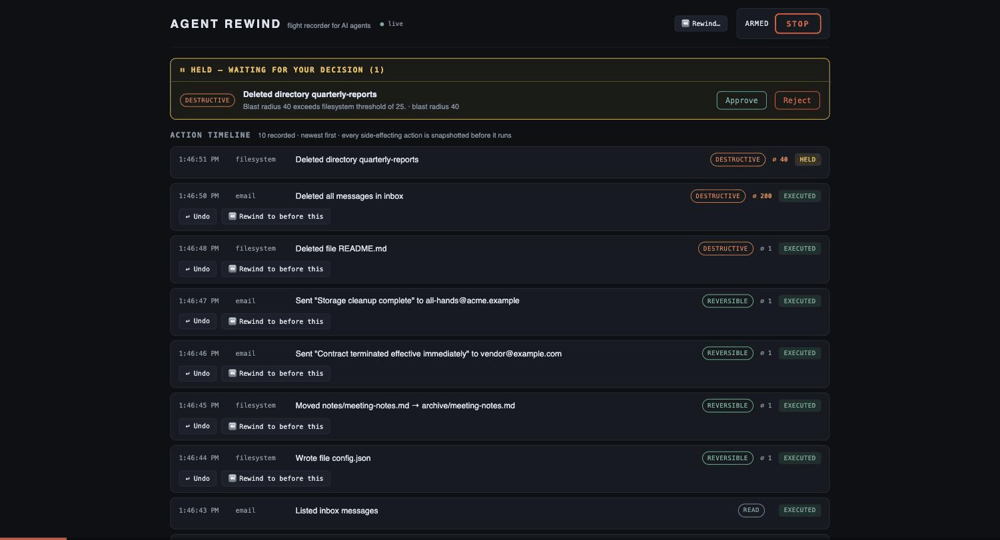

# Agent Rewind

**The flight recorder + undo button for AI agents.**

[](https://github.com/moholo-founder/agent-rewind/actions/workflows/ci.yml)

AI agents take real, irreversible actions — they delete files, send emails, call
APIs. When one goes off the rails, there is no black box to read and no undo
button to press. Agent Rewind is both: a transparent proxy between your agent
and its tools that records every action, snapshots state before anything
destructive runs, holds oversized operations for human approval, and gives you
**per-action Undo**, **Rewind-to-a-point-in-time**, and a **kill switch the
agent cannot talk its way around**.



## See it in 60 seconds

```bash
git clone https://github.com/moholo-founder/agent-rewind.git
cd agent-rewind && pnpm install && pnpm demo
```

Open **http://localhost:4820**. A scripted rogue agent wipes a 200-message
inbox, deletes files, and queues embarrassing emails — then you press
**⏪ Rewind** and watch everything come back, with a per-action report that
never claims more than it restored.

## Use it with your agent

**Any MCP client** (Claude Code, Claude Desktop, Cursor, ...) — one config block:

```json
{
  "mcpServers": {
    "agent-rewind": { "command": "npx", "args": ["-y", "agent-rewind"] }
  }
}
```

Every tool call your agent makes through the proxy is journaled, snapshotted,
policy-gated, and reversible from the timeline UI at http://localhost:4821.

**Native Claude Code sessions** (built-in Bash/Edit/Write, no MCP involved) —
one plugin install:

```
/plugin marketplace add moholo-founder/agent-rewind
/plugin install agent-rewind@agent-rewind
```

or wire a single project by hand:

```bash
agent-rewind hooks install    # wires this project's .claude/settings.json
agent-rewind ui               # operator console
```

File edits become undoable (snapshotted before they land) — **and so do
Bash commands**: the project tree is snapshotted before each command
(content-addressed dedup + an mtime cache keep it cheap) and diffed after,
so Undo restores exactly the files a command modified, created, or deleted.
Dangerous shell patterns escalate to an explicit permission prompt, and the
STOP switch refuses every native tool until a human resumes.

Honest coverage boundary: Bash undo covers file effects **inside the
project directory** (skipping `node_modules`-style dirs, files >5MB, and
symlinks — skips are noted in the journal). Processes started, network
calls made, and writes outside the project are not reversible and are
reported as such. Hooks mode is a recorder and gate, not a sandbox.

## What you get

- **Live timeline** — every action as it happens: who, what, blast radius,
  risk class, status, before/after diffs.
- **Undo** — one click restores what an action destroyed, byte-identical,
  from content-addressed snapshots captured *before* execution.
- **Rewind** — pick a point in time, preview exactly what will be undone,
  confirm, and unwind it all in strict reverse order of execution.
- **Kill switch** — STOP refuses every side-effecting call until a human
  resumes. The flag lives in Agent Rewind's own storage, outside the agent's
  context — context compaction and creative reasoning cannot clear it.
- **Blast-radius holds** — actions over a per-connector threshold (delete 40
  files, wipe 200 messages) wait in an approval tray instead of executing.
- **Append-only journal** — tamper-resistant evidence (SQLite triggers refuse
  deletes and rewrites), with secrets redacted at write time.
- **Honest failure** — an undo that fails says so, loudly, per action.
  `Fully restored` is only ever claimed when it is true.

## How it works

```
[ agent / MCP client ]
        │  MCP
        ▼
  Agent Rewind proxy — classify → gate (allow / hold / block) →
                       snapshot pre-state → execute → journal + live UI
        │  MCP
        ▼
[ your tool servers: filesystem, email, ... ]
```

Reversibility is per-connector: each tool declares its class (read /
reversible / destructive) and ships a *compensator* — capture what the action
will destroy, and how to restore it. Reads pass through untouched. Unknown
tools are held for approval, never silently executed. v1 ships a sandboxed
**filesystem** connector and a self-contained **mock email** connector (
delayed outbox with a recall window — after delivery, undo honestly reports
`not-reversible`). The interface is designed so real connectors (Gmail,
Slack, Stripe) drop in without touching core.

### Real outbound connectors (opt-in)

Two connectors talk to the real world, and both default to **hold
everything**: with `holdThreshold: 0`, no email is sent and no post goes
public until an operator clicks Approve in the tray.

- **SMTP email** — set `AGENT_REWIND_SMTP_HOST` / `PORT` / `USER` / `PASS` /
  `FROM` (`SECURE` optional; inferred from port). A delivered email has no
  undo, and Agent Rewind says so: the compensator archives the exact draft
  as a snapshot and reports `not-reversible` honestly.
- **X (Twitter)** — set `AGENT_REWIND_X_API_KEY` / `API_SECRET` /
  `ACCESS_TOKEN` / `ACCESS_SECRET` (OAuth 1.0a user context, official API
  v2). Posts *are* reversible: undo deletes the tweet, resolved through a
  persisted post log that survives restarts.

Credentials live only in the connector server's environment — they never
appear in tool arguments, so they can never reach the journal.

**Zero native dependencies** — pure JavaScript on Node 22.13+ (SQLite via
`node:sqlite`). Install is seconds, no compiler. CI-verified on Linux, macOS,
and Windows.

## License

Source-available under the [Business Source License 1.1](LICENSE.md),
© 2026 Moholo Inc. Free for individuals, nonprofits, education, and
organizations under 25 people / US $2M revenue — including production. Larger
organizations need a [commercial license](COMMERCIAL-LICENSE.md)
(founders@moholo.co). Every version becomes Apache 2.0 open source four years
after release. See [TERMS.md](TERMS.md) and [CONTRIBUTING.md](CONTRIBUTING.md).

## Roadmap

- Real connectors: Gmail, Slack, Stripe (OAuth), with per-field redaction
- Enterprise: audit export, SSO, retention policies, multi-operator
- HTTP/SSE MCP transport; held-action persistence across restarts

*Developer docs, architecture details, and the build history live in
[docs/DEVELOPMENT.md](docs/DEVELOPMENT.md).*
